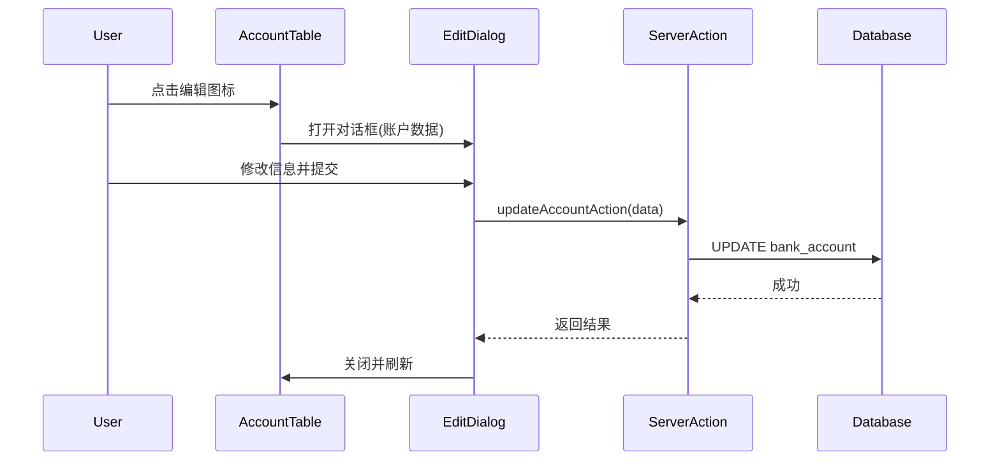

# Design Document

## Overview

本设计文档描述了家庭财富管理系统账户管理功能的改进方案。主要包括：添加账户编辑功能、界面全面中文化、表格样式美化、以及登录页面品牌统一。

## Architecture

### 组件结构

```
src/
├── components/
│   └── accounts/
│       ├── account-table.tsx      # 账户表格（修改）
│       └── edit-account-dialog.tsx # 新增：账户编辑对话框
├── actions/
│   └── account-actions.ts         # 账户操作（新增编辑功能）
└── app/
    └── (auth)/
        └── login/
            └── page.tsx           # 登录页面（修改品牌名称）
```

### 数据流



## Components and Interfaces

### 1. EditAccountDialog 组件

新增的账户编辑对话框组件。

```typescript
interface EditAccountDialogProps {
    account: Account
    open: boolean
    onOpenChange: (open: boolean) => void
    banks: Bank[]
    productTypes: ProductType[]
    currencies: Currency[]
}

interface Account {
    id: string
    bankName: string
    accountName: string
    productType: string | null
    currency: string | null
    expectedYield: number | null
    notes: string | null
}
```

### 2. AccountTable 组件修改

修改现有表格组件：
- 添加编辑图标按钮（在删除图标前）
- 移除更新时间列
- 中文化所有文本
- 美化表头样式

```typescript
// 新增 props
interface AccountTableProps {
    accounts: Account[]
    isAdmin?: boolean
    productTypes?: ProductType[]
    banks: Bank[]           // 新增
    currencies: Currency[]  // 新增
}
```

### 3. updateAccountAction 服务端操作

新增账户信息更新操作。

```typescript
async function updateAccountAction(
    accountId: string,
    data: {
        bankName: string
        accountName: string
        productType: string
        currency: string
        expectedYield: number | null
        notes: string | null
    }
): Promise<{ success?: boolean; error?: string }>
```

## Data Models

### 账户更新数据验证

```typescript
const updateAccountSchema = z.object({
    bankName: z.string().min(1, "请选择平台"),
    accountName: z.string().min(1, "请输入产品名称"),
    productType: z.string().min(1, "请选择产品类型"),
    currency: z.string().default("CNY"),
    expectedYield: z.coerce.number().optional().nullable(),
    notes: z.string().optional().nullable(),
})
```

## Correctness Properties

*A property is a characteristic or behavior that should hold true across all valid executions of a system-essentially, a formal statement about what the system should do. Properties serve as the bridge between human-readable specifications and machine-verifiable correctness guarantees.*


基于需求分析，以下是可测试的正确性属性：

### Property 1: 账户更新数据一致性

*For any* 有效的账户和更新数据，执行 updateAccountAction 后，数据库中的账户记录应该反映所有更新的字段值。

**Validates: Requirements 1.2, 5.5**

### Property 2: 权限控制 - 用户只能编辑自己的账户

*For any* 用户（无论是管理员还是普通用户）尝试编辑非自己创建的账户时，系统应该拒绝操作并返回权限错误。

**Validates: Requirements 1.5, 1.6**

### Property 3: 更新时间自动记录

*For any* 账户更新操作，数据库中的 updatedAt 字段应该被自动更新为当前时间。

**Validates: Requirements 3.2**

### Property 4: 编辑对话框默认值正确性

*For any* 账户数据传入编辑对话框时，所有表单字段的默认值应该与传入的账户数据完全匹配。

**Validates: Requirements 5.1**

### Property 5: 输入验证错误处理

*For any* 无效的账户更新数据（如空的平台名称、空的产品名称），系统应该返回相应的验证错误信息而不是执行更新。

**Validates: Requirements 5.6**

## Error Handling

### 服务端错误处理

| 错误场景 | 错误信息 | 处理方式 |
|---------|---------|---------|
| 用户未登录 | "未登录" | 返回错误，不执行操作 |
| 账户不存在 | "账户不存在" | 返回错误 |
| 无权编辑 | "无权编辑他人账户" | 返回错误 |
| 验证失败 | 具体字段错误 | 返回字段级错误信息 |
| 数据库错误 | "更新账户失败" | 记录日志，返回通用错误 |

### 客户端错误处理

- 表单验证失败时显示字段级错误提示
- 服务端错误时显示 alert 提示
- 网络错误时显示重试提示

## Testing Strategy

### 单元测试

1. **updateAccountAction 测试**
   - 测试有效数据更新成功
   - 测试无效数据返回验证错误
   - 测试权限检查逻辑

2. **组件测试**
   - EditAccountDialog 渲染测试
   - 表单默认值测试
   - 提交处理测试

### 属性测试

使用 fast-check 或类似库进行属性测试：

1. **数据一致性属性测试**
   - 生成随机有效账户数据
   - 执行更新操作
   - 验证数据库状态

2. **权限控制属性测试**
   - 生成随机用户和账户组合
   - 验证权限检查结果

### 测试配置

- 属性测试最少运行 100 次迭代
- 每个属性测试需要标注对应的设计属性编号
- 标注格式: **Feature: account-management-improvements, Property N: [属性描述]**

## UI 文本中文化清单

### AccountTable 组件

| 原文 | 中文 |
|-----|-----|
| Search... | 搜索... |
| All Banks | 所有平台 |
| All Types | 所有类型 |
| All | 全部 |
| Clear | 清除 |
| Results: X accounts | 筛选结果：X 个账户 |
| Owner | 所有者 |
| Bank | 平台 |
| Name | 产品名称 |
| Type | 产品类型 |
| Currency | 币种 |
| Balance | 余额 |
| Yield | 预期收益 |
| Actions | 操作 |
| No matching accounts | 没有匹配的账户 |
| No accounts yet | 暂无账户 |
| Delete this account? | 确定要删除此账户吗？ |

### LoginPage 组件

| 原文 | 中文 |
|-----|-----|
| Wealth Manager | 家庭财富管家 |
