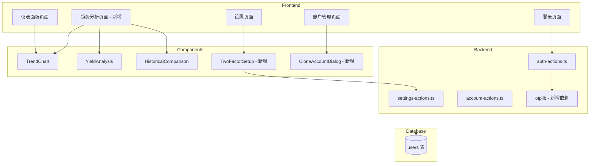

# Design Document: Dashboard UI Improvements

## Overview

本设计文档描述了家庭财富管家 v0.3.0 版本的改进，包括仪表面板 UI 简化、两步验证功能、账户克隆功能等。

## Architecture

### 系统架构变更



### 数据流

1. **两步验证流程**:
   - 用户在设置页面启用 2FA → 生成 TOTP secret → 显示 QR 码 → 用户扫码 → 验证首次 TOTP 码 → 保存到数据库
   - 登录时：密码验证通过 → 检查 2FA 状态 → 如启用则要求 TOTP 码 → 验证 TOTP → 完成登录

2. **账户克隆流程**:
   - 用户点击克隆按钮 → 打开预填充的添加账户对话框 → 用户修改账户名 → 提交创建新账户

## Components and Interfaces

### 新增组件

#### 1. TwoFactorSetup 组件

```typescript
// src/components/settings/two-factor-setup.tsx
interface TwoFactorSetupProps {
  userId: string
  isEnabled: boolean
  onStatusChange: (enabled: boolean) => void
}

// 状态
interface TwoFactorState {
  step: 'idle' | 'setup' | 'verify' | 'enabled'
  secret?: string
  qrCodeUrl?: string
  verifyCode: string
  error?: string
}
```

#### 2. CloneAccountDialog 组件

```typescript
// 复用 AddAccountDialog，添加 cloneFrom 属性
interface AddAccountDialogProps {
  // ... existing props
  cloneFrom?: {
    bankName: string
    productType: string | null
    currency: string | null
    expectedYield: number | null
    notes: string | null
  }
}
```

#### 3. TrendsPage 页面

```typescript
// src/app/(dashboard)/trends/page.tsx
// 包含 TrendChart, YieldAnalysis, HistoricalComparison 组件
```

### 修改的组件

#### 1. Dashboard 页面
- 移除平均余额卡片
- 移除标题和副标题
- 移除 TrendChart, YieldAnalysis, HistoricalComparison 组件

#### 2. AccountTable 组件
- 添加克隆按钮到操作列

#### 3. LoginForm 组件
- 添加 TOTP 验证步骤（当 2FA 启用时）

#### 4. SettingsForm 组件
- 添加 TwoFactorSetup 组件

#### 5. AppSidebar 组件
- 更新版本号为 v0.3.0

### Server Actions

#### 新增 Actions

```typescript
// src/actions/settings-actions.ts

// 生成 2FA secret 和 QR 码
export async function generate2FASecretAction(): Promise<{
  secret: string
  qrCodeUrl: string
} | { error: string }>

// 验证并启用 2FA
export async function enable2FAAction(code: string): Promise<{
  success: boolean
} | { error: string }>

// 禁用 2FA
export async function disable2FAAction(password: string): Promise<{
  success: boolean
} | { error: string }>

// 获取 2FA 状态
export async function get2FAStatusAction(): Promise<{
  enabled: boolean
}>
```

#### 修改 Actions

```typescript
// src/actions/auth-actions.ts

// 修改登录验证，支持 2FA
export async function loginAction(
  email: string, 
  password: string, 
  totpCode?: string
): Promise<{ 
  success: boolean
  requires2FA?: boolean 
} | { error: string }>
```

## Data Models

### 数据库 Schema 变更

```typescript
// src/db/schema.ts - users 表新增字段

export const users = pgTable("user", {
    // ... existing fields
    twoFactorSecret: text("two_factor_secret"),  // 新增：TOTP secret (加密存储)
    twoFactorEnabled: boolean("two_factor_enabled").default(false),  // 新增：2FA 启用状态
});
```

### TOTP 配置

```typescript
// TOTP 配置参数
const TOTP_CONFIG = {
  issuer: '家庭财富管家',
  algorithm: 'SHA1',
  digits: 6,
  period: 30,  // 30秒有效期
}
```

## Correctness Properties

*A property is a characteristic or behavior that should hold true across all valid executions of a system-essentially, a formal statement about what the system should do. Properties serve as the bridge between human-readable specifications and machine-verifiable correctness guarantees.*

### Property 1: TOTP Round Trip Verification

*For any* valid TOTP secret generated by the system, generating a TOTP code at the current time and immediately verifying it against the same secret should succeed.

**Validates: Requirements 3.1, 3.4**

### Property 2: TOTP Invalid Code Rejection

*For any* TOTP secret and any 6-digit code that does not match the current or adjacent time windows, verification should fail.

**Validates: Requirements 3.6**

### Property 3: Clone Pre-fill Correctness

*For any* source account with valid data, the clone operation should produce a pre-fill object where:
- bankName equals source.bankName
- productType equals source.productType
- currency equals source.currency
- expectedYield equals source.expectedYield
- notes equals source.notes
- accountName is empty string
- balance is 0

**Validates: Requirements 5.3, 5.4**

## Error Handling

### 两步验证错误处理

| 错误场景 | 错误消息 | 处理方式 |
|---------|---------|---------|
| TOTP 码格式无效 | "验证码必须是6位数字" | 前端验证 |
| TOTP 码验证失败 | "验证码错误，请重试" | 显示错误，允许重试 |
| 2FA 设置超时 | "设置超时，请重新开始" | 重置设置流程 |
| 禁用 2FA 密码错误 | "密码错误" | 显示错误，允许重试 |

### 账户克隆错误处理

| 错误场景 | 错误消息 | 处理方式 |
|---------|---------|---------|
| 账户名为空 | "请输入账户名称" | 前端验证 |
| 账户名重复 | "该账户名称已存在" | 显示错误 |
| 创建失败 | "创建账户失败，请重试" | 显示错误 |

## Testing Strategy

### 测试框架

- **单元测试**: Vitest
- **属性测试**: fast-check (与 Vitest 集成)
- **组件测试**: React Testing Library

### 单元测试

1. **TOTP 工具函数测试**
   - 测试 secret 生成
   - 测试 QR 码 URL 生成
   - 测试验证码验证

2. **克隆数据预填充测试**
   - 测试正确字段被复制
   - 测试 accountName 和 balance 不被复制

3. **UI 组件测试**
   - 测试仪表面板不显示平均余额卡片
   - 测试仪表面板不显示标题
   - 测试趋势页面包含所有组件

### 属性测试

每个属性测试配置：
- 最少 100 次迭代
- 使用 fast-check 生成随机输入
- 标注对应的设计属性编号

```typescript
// 示例：TOTP 验证属性测试
// Feature: dashboard-ui-improvements, Property 1: TOTP Round Trip Verification
test.prop([fc.string({ minLength: 32, maxLength: 32 })])('TOTP round trip', (secret) => {
  const code = generateTOTP(secret)
  expect(verifyTOTP(secret, code)).toBe(true)
})
```

### 测试覆盖目标

- TOTP 工具函数: 100% 覆盖
- 克隆预填充逻辑: 100% 覆盖
- UI 组件关键路径: 主要流程覆盖
