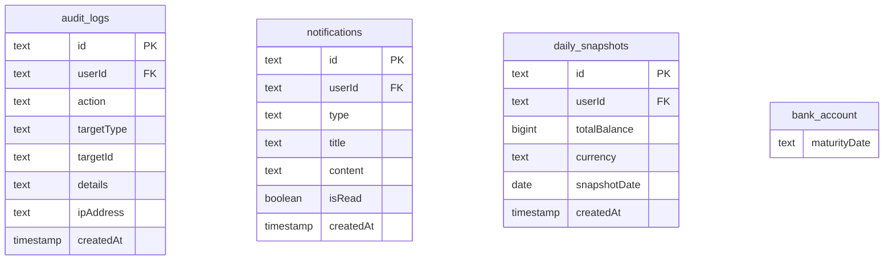

# Design Document

## Overview

本设计文档描述了家庭财富管理系统的全面增强方案，包括：
1. **Bug 修复** - UI 中文化、货币符号、用户信息显示等
2. **安全性加固** - 权限漏洞修复、审计日志、请求频率限制
3. **数据可视化增强** - 饼图、趋势图表、收益分析
4. **通知与提醒** - 系统通知、余额变动、到期提醒

## Architecture

### 新增组件结构

```
src/
├── components/
│   ├── charts/
│   │   ├── pie-chart.tsx           # 通用饼图组件
│   │   └── line-chart.tsx          # 趋势折线图组件
│   ├── notifications/
│   │   ├── notification-bell.tsx   # 通知铃铛图标
│   │   └── notification-list.tsx   # 通知列表
│   └── ui/
│       └── user-info.tsx           # 用户信息显示组件
├── actions/
│   ├── audit-actions.ts            # 审计日志操作
│   ├── notification-actions.ts     # 通知操作
│   └── snapshot-actions.ts         # 资产快照操作
├── lib/
│   ├── rate-limiter.ts             # 请求频率限制器
│   └── audit-logger.ts             # 审计日志工具
└── db/
    └── schema.ts                   # 新增表定义
```

### 数据库 Schema 扩展



## Components and Interfaces

### 1. 审计日志系统

```typescript
// src/lib/audit-logger.ts
interface AuditLogEntry {
    userId: string
    action: AuditAction
    targetType: 'user' | 'account' | 'balance' | 'config'
    targetId: string
    details?: Record<string, any>
    ipAddress?: string
}

type AuditAction = 
    | 'LOGIN_SUCCESS' | 'LOGIN_FAILED'
    | 'ACCOUNT_CREATE' | 'ACCOUNT_UPDATE' | 'ACCOUNT_DELETE'
    | 'BALANCE_UPDATE'
    | 'USER_CREATE' | 'USER_DELETE' | 'USER_ROLE_UPDATE'
    | 'PASSWORD_RESET'

async function logAudit(entry: AuditLogEntry): Promise<void>
```

### 2. 请求频率限制器

```typescript
// src/lib/rate-limiter.ts
interface RateLimiterConfig {
    windowMs: number      // 时间窗口（毫秒）
    maxRequests: number   // 最大请求数
}

class RateLimiter {
    constructor(config: RateLimiterConfig)
    
    // 检查是否允许请求，返回剩余次数或 null（被限制）
    check(key: string): { remaining: number; resetAt: Date } | null
    
    // 重置计数
    reset(key: string): void
}

// 登录限制器：5分钟10次
const loginLimiter = new RateLimiter({ windowMs: 5 * 60 * 1000, maxRequests: 10 })

// API限制器：1分钟100次
const apiLimiter = new RateLimiter({ windowMs: 60 * 1000, maxRequests: 100 })
```

### 3. 通知系统

```typescript
// src/actions/notification-actions.ts
interface Notification {
    id: string
    userId: string
    type: 'BALANCE_CHANGE' | 'MATURITY_REMINDER' | 'SYSTEM'
    title: string
    content: string
    isRead: boolean
    createdAt: Date
}

async function createNotification(data: Omit<Notification, 'id' | 'createdAt'>): Promise<void>
async function getUnreadNotifications(userId: string): Promise<Notification[]>
async function markAsRead(notificationId: string): Promise<void>
async function markAllAsRead(userId: string): Promise<void>
```

### 4. 饼图组件

```typescript
// src/components/charts/pie-chart.tsx
interface PieChartProps {
    data: Array<{
        name: string
        value: number
        color?: string
    }>
    onSliceClick?: (name: string) => void
    showPercentage?: boolean
    showValue?: boolean
}
```

### 5. 用户信息组件

```typescript
// src/components/ui/user-info.tsx
interface UserInfoProps {
    user: {
        name: string | null
        email: string
    }
    version: string
    onLogout: () => void
}
```

## Data Models

### 新增数据表

```typescript
// src/db/schema.ts 新增

// 审计日志表
export const auditLogs = pgTable("audit_logs", {
    id: text("id").primaryKey().$defaultFn(() => crypto.randomUUID()),
    userId: text("userId").references(() => users.id, { onDelete: "set null" }),
    action: text("action").notNull(),
    targetType: text("targetType").notNull(),
    targetId: text("targetId"),
    details: text("details"), // JSON string
    ipAddress: text("ipAddress"),
    createdAt: timestamp("created_at", { mode: "date" }).defaultNow(),
})

// 通知表
export const notifications = pgTable("notifications", {
    id: text("id").primaryKey().$defaultFn(() => crypto.randomUUID()),
    userId: text("userId").notNull().references(() => users.id, { onDelete: "cascade" }),
    type: text("type").notNull(),
    title: text("title").notNull(),
    content: text("content").notNull(),
    isRead: boolean("is_read").default(false),
    createdAt: timestamp("created_at", { mode: "date" }).defaultNow(),
})

// 每日资产快照表
export const dailySnapshots = pgTable("daily_snapshots", {
    id: text("id").primaryKey().$defaultFn(() => crypto.randomUUID()),
    userId: text("userId").notNull().references(() => users.id, { onDelete: "cascade" }),
    totalBalance: bigint("total_balance", { mode: "number" }).notNull(),
    currency: text("currency").default("CNY"),
    snapshotDate: date("snapshot_date").notNull(),
    createdAt: timestamp("created_at", { mode: "date" }).defaultNow(),
})

// bank_account 表新增字段
// maturityDate: date("maturity_date") // 到期日期
```

### 货币符号映射

```typescript
// src/lib/currency.ts
export function getCurrencySymbol(currency: string | null): string {
    switch (currency) {
        case "USD": return "$"
        case "HKD": return "HK$"
        case "EUR": return "€"
        case "CNY":
        default: return "¥"
    }
}
```

## Correctness Properties

*A property is a characteristic or behavior that should hold true across all valid executions of a system-essentially, a formal statement about what the system should do. Properties serve as the bridge between human-readable specifications and machine-verifiable correctness guarantees.*

### Property 1: 货币符号正确性

*For any* 货币代码，getCurrencySymbol 函数应返回对应的正确符号，特别是 CNY 应返回 "¥" 而非 "Y"。

**Validates: Requirements 0.2.1, 0.2.2**

### Property 2: 余额更新权限控制

*For any* 用户尝试更新账户余额时，如果该账户不属于当前用户且当前用户不是管理员，系统应拒绝操作并返回权限错误。

**Validates: Requirements 1.1.1, 1.1.2, 1.1.3**

### Property 3: 账户历史查询权限控制

*For any* 用户查询账户历史时，如果该账户不属于当前用户且当前用户不是管理员，系统应返回空结果或权限错误。

**Validates: Requirements 1.2.1, 1.2.2, 1.2.3**

### Property 4: 审计日志完整性

*For any* 敏感操作（登录、账户操作、用户管理等），系统应在操作完成后创建包含用户ID、操作类型、目标对象和时间戳的审计日志记录。

**Validates: Requirements 1.3.2, 1.3.3**

### Property 5: 登录频率限制

*For any* IP地址，在5分钟时间窗口内，登录尝试次数超过10次后，后续登录请求应被拒绝并返回频率限制错误。

**Validates: Requirements 1.4.1, 1.4.2**

### Property 6: 登录成功重置计数

*For any* IP地址，当登录成功后，该IP的失败计数应被重置为0。

**Validates: Requirements 1.4.3**

### Property 7: 筛选结果外币折算

*For any* 账户列表筛选结果，合计金额应将所有外币账户按当前汇率正确折算为人民币后求和。

**Validates: Requirements 0.6.1, 0.6.2**

### Property 8: 余额变动通知触发

*For any* 账户余额更新，当变动金额超过用户设定阈值（默认10%或1000元）时，系统应创建余额变动通知。

**Validates: Requirements 3.2.1**

### Property 9: 到期提醒通知

*For any* 设置了到期日期的定期理财账户，当距离到期日还有7天或1天时，系统应创建到期提醒通知。

**Validates: Requirements 3.3.3, 3.3.4**

## Error Handling

### 权限错误

| 场景 | 错误信息 | HTTP状态码 |
|-----|---------|-----------|
| 更新非自己账户余额 | "无权修改他人账户余额" | 403 |
| 查看非自己账户历史 | "无权查看他人账户历史" | 403 |
| 非管理员查看审计日志 | "无权限" | 403 |

### 频率限制错误

| 场景 | 错误信息 | HTTP状态码 |
|-----|---------|-----------|
| 登录尝试过于频繁 | "登录尝试过于频繁，请5分钟后再试" | 429 |
| API请求过于频繁 | "请求过于频繁，请稍后再试" | 429 |

## Testing Strategy

### 单元测试

1. **getCurrencySymbol 函数测试**
   - 测试所有支持的货币代码
   - 测试 null 和未知货币的默认值

2. **RateLimiter 类测试**
   - 测试正常请求计数
   - 测试超限拒绝
   - 测试时间窗口重置
   - 测试手动重置

3. **权限检查函数测试**
   - 测试所有者访问
   - 测试非所有者访问
   - 测试管理员访问

### 属性测试

使用 fast-check 进行属性测试：

1. **权限控制属性测试**
   - 生成随机用户和账户组合
   - 验证权限检查结果符合预期

2. **频率限制属性测试**
   - 生成随机请求序列
   - 验证限制器行为正确

3. **金额折算属性测试**
   - 生成随机账户和汇率
   - 验证折算计算正确

### 测试配置

- 属性测试最少运行 100 次迭代
- 每个属性测试需要标注对应的设计属性编号
- 标注格式: **Feature: security-and-features-enhancement, Property N: [属性描述]**

## UI 文本中文化清单

### AccountTable 组件表头

| 原文 | 中文 |
|-----|-----|
| Owner | 所有者 |
| Bank | 平台 |
| Name | 产品名称 |
| Type | 产品类型 |
| Currency | 币种 |
| Balance | 余额 |
| Yield | 预期收益 |
| Actions | 操作 |

### 其他文本

| 位置 | 原文 | 中文 |
|-----|-----|-----|
| 侧边栏 | 仪表盘 | 仪表面板 |
| Dashboard标题 | 仪表盘 | 仪表面板 |
| 筛选结果 | 合计 | 合计 (折算CNY) |

## 图表库选择

推荐使用 **Recharts** 库：
- 基于 React 和 D3
- 支持响应式设计
- 提供饼图、折线图等组件
- 与 shadcn/ui 风格兼容

```bash
pnpm add recharts
```
