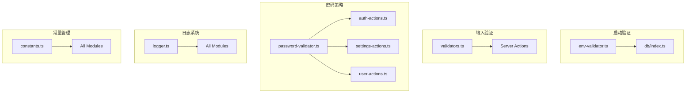

# 设计文档：安全增强与代码优化

## Overview

本设计文档针对 P1 和 P2 优先级的改进需求，提供具体的技术实现方案。主要包括：
1. 环境变量启动验证
2. 密码策略增强
3. 输入验证增强
4. 敏感信息日志清理
5. 数据库查询优化
6. 错误处理统一
7. 常量提取

## Architecture

### 改进模块关系图



## Components and Interfaces

### 1. 环境变量验证器

**文件**: `src/lib/env-validator.ts`

```typescript
interface EnvConfig {
    DATABASE_URL: string
    AUTH_SECRET: string
    NODE_ENV: 'development' | 'production' | 'test'
}

function validateEnv(): EnvConfig {
    const errors: string[] = []
    
    if (!process.env.DATABASE_URL) {
        errors.push('DATABASE_URL is required')
    }
    
    if (!process.env.AUTH_SECRET) {
        errors.push('AUTH_SECRET is required')
    } else if (process.env.AUTH_SECRET.length < 32) {
        errors.push('AUTH_SECRET must be at least 32 characters')
    }
    
    if (errors.length > 0) {
        throw new Error(`Environment validation failed:\n${errors.join('\n')}`)
    }
    
    return {
        DATABASE_URL: process.env.DATABASE_URL!,
        AUTH_SECRET: process.env.AUTH_SECRET!,
        NODE_ENV: (process.env.NODE_ENV as any) || 'development'
    }
}

export const env = validateEnv()
```

### 2. 密码验证器

**文件**: `src/lib/password-validator.ts`

```typescript
interface PasswordValidationResult {
    isValid: boolean
    errors: string[]
}

const PASSWORD_RULES = {
    minLength: 8,
    requireUppercase: true,
    requireLowercase: true,
    requireDigit: true,
}

function validatePassword(password: string): PasswordValidationResult {
    const errors: string[] = []
    
    if (password.length < PASSWORD_RULES.minLength) {
        errors.push(`密码长度至少为${PASSWORD_RULES.minLength}位`)
    }
    if (PASSWORD_RULES.requireUppercase && !/[A-Z]/.test(password)) {
        errors.push('密码必须包含至少一个大写字母')
    }
    if (PASSWORD_RULES.requireLowercase && !/[a-z]/.test(password)) {
        errors.push('密码必须包含至少一个小写字母')
    }
    if (PASSWORD_RULES.requireDigit && !/\d/.test(password)) {
        errors.push('密码必须包含至少一个数字')
    }
    
    return {
        isValid: errors.length === 0,
        errors
    }
}
```

### 3. 输入验证器

**文件**: `src/lib/validators.ts`

```typescript
import { z } from 'zod'

// UUID 验证
export const uuidSchema = z.string().uuid('无效的 ID 格式')

// 角色验证
export const roleSchema = z.enum(['ADMIN', 'MEMBER'], {
    errorMap: () => ({ message: '无效的角色' })
})

// 金额验证（分为单位）
export const amountSchema = z.number()
    .min(0, '金额不能为负')
    .max(999999999999, '金额超出范围')

// 通用验证函数
export function validateUUID(id: string): boolean {
    return uuidSchema.safeParse(id).success
}

export function validateRole(role: string): role is 'ADMIN' | 'MEMBER' {
    return roleSchema.safeParse(role).success
}
```

### 4. 结构化日志器

**文件**: `src/lib/logger.ts`

```typescript
type LogLevel = 'debug' | 'info' | 'warn' | 'error'

interface LogEntry {
    level: LogLevel
    message: string
    context?: Record<string, unknown>
    timestamp: string
}

const isProduction = process.env.NODE_ENV === 'production'

function sanitize(data: Record<string, unknown>): Record<string, unknown> {
    const sensitiveKeys = ['password', 'secret', 'token', 'email']
    const sanitized = { ...data }
    
    for (const key of Object.keys(sanitized)) {
        if (sensitiveKeys.some(sk => key.toLowerCase().includes(sk))) {
            sanitized[key] = '[REDACTED]'
        }
    }
    
    return sanitized
}

export const logger = {
    debug(message: string, context?: Record<string, unknown>) {
        if (!isProduction) {
            console.log(JSON.stringify({
                level: 'debug',
                message,
                context: context ? sanitize(context) : undefined,
                timestamp: new Date().toISOString()
            }))
        }
    },
    
    info(message: string, context?: Record<string, unknown>) {
        console.log(JSON.stringify({
            level: 'info',
            message,
            context: context ? sanitize(context) : undefined,
            timestamp: new Date().toISOString()
        }))
    },
    
    warn(message: string, context?: Record<string, unknown>) {
        console.warn(JSON.stringify({
            level: 'warn',
            message,
            context: context ? sanitize(context) : undefined,
            timestamp: new Date().toISOString()
        }))
    },
    
    error(message: string, error?: Error, context?: Record<string, unknown>) {
        console.error(JSON.stringify({
            level: 'error',
            message,
            error: isProduction ? error?.message : error?.stack,
            context: context ? sanitize(context) : undefined,
            timestamp: new Date().toISOString()
        }))
    }
}
```

### 5. 常量定义

**文件**: `src/lib/constants.ts` (扩展)

```typescript
// 货币转换
export const CENTS_PER_UNIT = 100

// 收益率存储（万分之一）
export const YIELD_MULTIPLIER = 100

// 缓存时间
export const CACHE_DURATION_MS = 6 * 60 * 60 * 1000 // 6 hours

// Session 过期时间
export const PENDING_2FA_EXPIRY_MS = 5 * 60 * 1000 // 5 minutes
export const PENDING_SECRET_EXPIRY_MS = 5 * 60 * 1000 // 5 minutes

// Rate Limiting
export const LOGIN_RATE_LIMIT = {
    windowMs: 5 * 60 * 1000, // 5 minutes
    maxRequests: 10
}

export const API_RATE_LIMIT = {
    windowMs: 60 * 1000, // 1 minute
    maxRequests: 100
}

// 密码策略
export const PASSWORD_POLICY = {
    minLength: 8,
    requireUppercase: true,
    requireLowercase: true,
    requireDigit: true,
}

// 分页
export const DEFAULT_PAGE_SIZE = 20
export const MAX_PAGE_SIZE = 100
```

### 6. 统一错误处理

**文件**: `src/lib/result.ts`

```typescript
// 成功结果
export type Success<T> = {
    success: true
    data: T
}

// 失败结果
export type Failure = {
    success: false
    error: string
    code?: string
}

// 统一结果类型
export type Result<T> = Success<T> | Failure

// 辅助函数
export function success<T>(data: T): Success<T> {
    return { success: true, data }
}

export function failure(error: string, code?: string): Failure {
    return { success: false, error, code }
}

// 错误码
export const ErrorCodes = {
    UNAUTHORIZED: 'UNAUTHORIZED',
    FORBIDDEN: 'FORBIDDEN',
    NOT_FOUND: 'NOT_FOUND',
    VALIDATION_ERROR: 'VALIDATION_ERROR',
    RATE_LIMITED: 'RATE_LIMITED',
    INTERNAL_ERROR: 'INTERNAL_ERROR',
} as const
```

### 7. 数据库查询优化

**优化 seedHistoricalSnapshots 函数**:

```typescript
// 之前：N+1 查询
for (const user of targetUsers) {
    const accounts = await db.query.bankAccounts.findMany({
        where: eq(bankAccounts.userId, user.id)
    })
    // ...
}

// 之后：批量查询
const allAccounts = await db.query.bankAccounts.findMany({
    where: targetUserId 
        ? eq(bankAccounts.userId, targetUserId)
        : undefined
})

// 按用户分组
const accountsByUser = new Map<string, typeof allAccounts>()
for (const account of allAccounts) {
    const userAccounts = accountsByUser.get(account.userId) || []
    userAccounts.push(account)
    accountsByUser.set(account.userId, userAccounts)
}

// 处理每个用户
for (const user of targetUsers) {
    const accounts = accountsByUser.get(user.id) || []
    // ...
}
```

**优化 createAllUsersSnapshotsAction 函数**:

```typescript
// 之前：每个用户单独查询账户
for (const user of allUsers) {
    const accounts = await db.query.bankAccounts.findMany({ 
        where: eq(bankAccounts.userId, user.id) 
    })
    // ...
}

// 之后：一次性查询所有账户，内存分组
const allAccounts = await db.query.bankAccounts.findMany()
const accountsByUser = groupBy(allAccounts, 'userId')

for (const user of allUsers) {
    const accounts = accountsByUser.get(user.id) || []
    // ...
}
```

**优化 refreshExchangeRates 函数**:

```typescript
// 之前：每个货币单独 upsert
for (const code of configuredCodes) {
    const existing = await db.query.exchangeRates.findFirst(...)
    if (existing) {
        await db.update(...)
    } else {
        await db.insert(...)
    }
}

// 之后：使用 onConflictDoUpdate 批量 upsert
const ratesToUpsert = configuredCodes
    .filter(code => code !== "CNY" && apiRates[code])
    .map(code => ({
        code,
        rate: (1 / apiRates[code]).toFixed(6),
        updatedAt: new Date()
    }))

for (const rate of ratesToUpsert) {
    await db.insert(exchangeRates)
        .values(rate)
        .onConflictDoUpdate({
            target: exchangeRates.code,
            set: { rate: rate.rate, updatedAt: rate.updatedAt }
        })
}
```

### 8. React 缓存优化

**使用 React cache 缓存频繁查询**:

```typescript
import { cache } from 'react'

// 缓存当前用户信息（同一请求内复用）
export const getCurrentUser = cache(async () => {
    const session = await auth()
    if (!session?.user?.id) return null
    
    return db.query.users.findFirst({
        where: eq(users.id, session.user.id)
    })
})

// 缓存汇率数据
export const getExchangeRatesMap = cache(async () => {
    const rates = await db.query.exchangeRates.findMany()
    const ratesMap = new Map<string, number>()
    rates.forEach(r => ratesMap.set(r.code, parseFloat(r.rate)))
    ratesMap.set("CNY", 1.0)
    return ratesMap
})
```

### 9. 数据库索引建议

**建议添加的索引**:

```sql
-- 快照查询优化
CREATE INDEX idx_daily_snapshots_user_date 
ON daily_snapshots(userId, snapshot_date);

-- 审计日志查询优化
CREATE INDEX idx_audit_logs_created_at 
ON audit_logs(created_at DESC);

CREATE INDEX idx_audit_logs_user_action 
ON audit_logs(userId, action);

-- 账户查询优化
CREATE INDEX idx_bank_accounts_user 
ON bank_account(userId);
```

## Data Models

本次改进不需要新增数据库表，主要是代码层面的优化。

## Correctness Properties

*A property is a characteristic or behavior that should hold true across all valid executions of a system-essentially, a formal statement about what the system should do.*

### Property 1: 环境变量验证完整性

*For any* 环境配置，如果 DATABASE_URL 缺失或 AUTH_SECRET 缺失或长度小于 32 字符，环境验证器应返回失败并包含描述性错误信息。

**Validates: Requirements 1.1, 1.2, 1.3, 1.4**

### Property 2: 密码策略验证

*For any* 密码字符串，密码验证器应正确判断是否满足所有策略要求（长度>=8、包含大写、包含小写、包含数字），并返回所有不满足的规则列表。

**Validates: Requirements 2.1, 2.2, 2.3, 2.4, 2.5**

### Property 3: 角色参数验证

*For any* 字符串输入，角色验证器应仅接受 "ADMIN" 或 "MEMBER"，其他任何值应返回验证失败。

**Validates: Requirements 3.1**

### Property 4: UUID 格式验证

*For any* 字符串输入，UUID 验证器应正确区分有效 UUID 格式和无效格式。

**Validates: Requirements 3.2**

### Property 5: 日志敏感信息过滤

*For any* 包含敏感字段（password、secret、token、email）的日志对象，日志器应将这些字段的值替换为 "[REDACTED]"。

**Validates: Requirements 4.1**

### Property 6: 错误响应结构一致性

*For any* action 失败响应，应包含 `success: false` 和 `error` 字符串字段。

**Validates: Requirements 6.2**

## Error Handling

| 场景 | 错误码 | 错误信息 |
|------|--------|----------|
| 环境变量缺失 | STARTUP_ERROR | 具体缺失的变量名 |
| 密码不符合策略 | VALIDATION_ERROR | 具体不满足的规则 |
| 无效的角色参数 | VALIDATION_ERROR | "无效的角色" |
| 无效的 UUID | VALIDATION_ERROR | "无效的 ID 格式" |
| 未登录 | UNAUTHORIZED | "未登录" |
| 无权限 | FORBIDDEN | "无权限" |

## Testing Strategy

### 单元测试

1. **密码验证器测试**
   - 测试各种密码组合是否正确验证
   - 测试错误信息是否准确

2. **输入验证器测试**
   - 测试 UUID 验证
   - 测试角色验证

3. **日志器测试**
   - 测试敏感信息是否被过滤

### 属性测试

1. **Property 2 测试**: 生成随机密码，验证策略检查的一致性
2. **Property 4 测试**: 生成随机字符串，验证 UUID 验证的准确性
3. **Property 5 测试**: 生成包含敏感信息的日志，验证过滤效果

### 集成测试

1. 环境变量缺失时的启动行为
2. 密码修改流程的完整验证
3. 各 action 的输入验证
