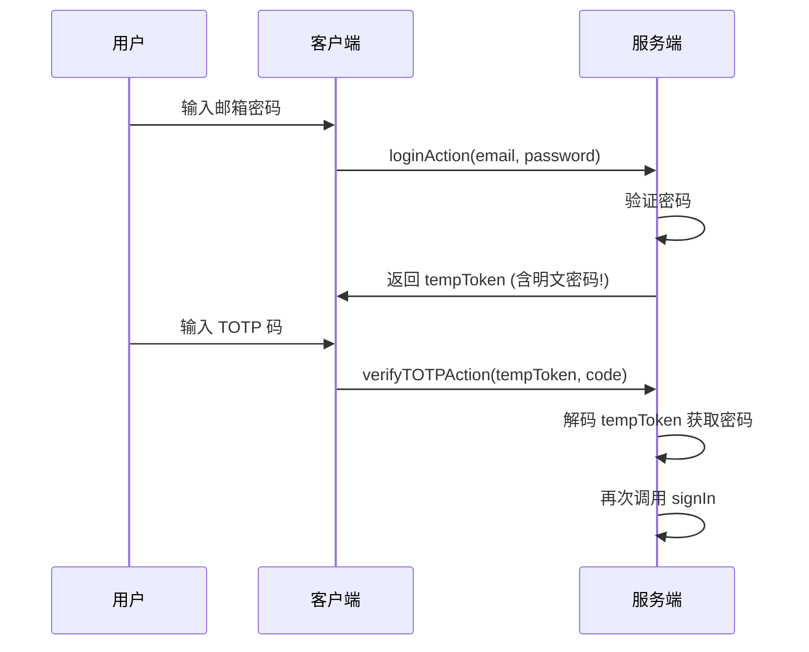
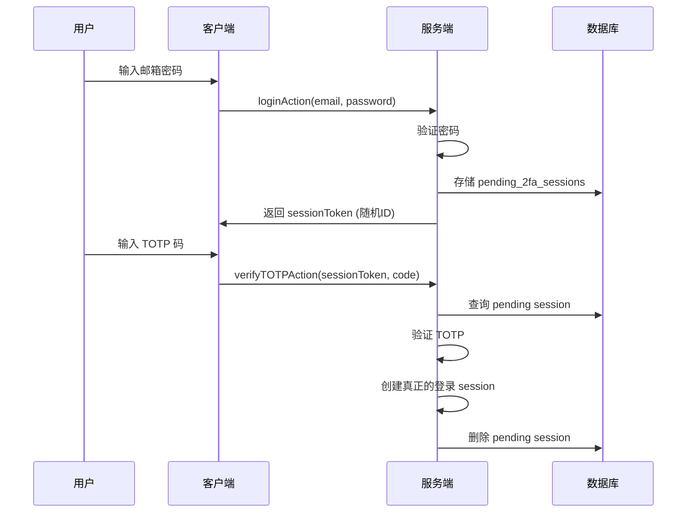

# 设计文档：安全与优化改进

## Overview

本设计文档针对项目审查中发现的问题，提供具体的技术解决方案。重点解决 2FA 临时 token 安全漏洞，并提供代码优化建议。

## Architecture

### 当前 2FA 登录流程（存在安全问题）



### 改进后的 2FA 登录流程



## Components and Interfaces

### 1. 新增数据库表：pending_2fa_sessions

用于临时存储已通过密码验证但等待 2FA 验证的会话。

```typescript
// src/db/schema.ts 新增
export const pending2FASessions = pgTable("pending_2fa_sessions", {
    id: text("id").primaryKey().$defaultFn(() => crypto.randomUUID()),
    userId: text("userId")
        .notNull()
        .references(() => users.id, { onDelete: "cascade" }),
    token: text("token").notNull().unique(), // 随机生成的 token
    expiresAt: timestamp("expires_at", { mode: "date" }).notNull(),
    createdAt: timestamp("created_at", { mode: "date" }).defaultNow(),
});
```

### 2. 修改 auth-actions.ts

#### loginAction 改进

```typescript
export async function loginAction(formData: FormData): Promise<{ 
    success: boolean; 
    error?: string;
    requires2FA?: boolean;
    sessionToken?: string;  // 改名，不再叫 tempToken
}> {
    // ... 验证密码逻辑不变 ...

    // 检查是否启用了 2FA
    if (user.twoFactorEnabled && user.twoFactorSecret) {
        // 生成随机 token，不包含任何敏感信息
        const sessionToken = crypto.randomUUID()
        const expiresAt = new Date(Date.now() + 5 * 60 * 1000) // 5分钟过期

        // 存储到数据库
        await db.insert(pending2FASessions).values({
            userId: user.id,
            token: sessionToken,
            expiresAt,
        })

        return { 
            success: false, 
            requires2FA: true,
            sessionToken  // 只返回随机 token，不含密码
        }
    }
    // ... 其余逻辑不变 ...
}
```

#### verifyTOTPAction 改进

```typescript
export async function verifyTOTPAction(
    sessionToken: string, 
    totpCode: string
): Promise<{ success: boolean; error?: string }> {
    // ... 验证码格式检查 ...

    // 从数据库查询 pending session
    const pendingSession = await db.query.pending2FASessions.findFirst({
        where: eq(pending2FASessions.token, sessionToken)
    })

    if (!pendingSession) {
        return { success: false, error: "验证会话不存在或已过期" }
    }

    // 检查是否过期
    if (new Date() > pendingSession.expiresAt) {
        await db.delete(pending2FASessions)
            .where(eq(pending2FASessions.id, pendingSession.id))
        return { success: false, error: "验证已过期，请重新登录" }
    }

    // 获取用户信息
    const user = await db.query.users.findFirst({
        where: eq(users.id, pendingSession.userId)
    })

    if (!user || !user.twoFactorSecret) {
        return { success: false, error: "验证失败" }
    }

    // 验证 TOTP 码
    const isValidTOTP = verifyTOTP(user.twoFactorSecret, totpCode)
    if (!isValidTOTP) {
        return { success: false, error: "验证码错误，请重试" }
    }

    // 删除 pending session
    await db.delete(pending2FASessions)
        .where(eq(pending2FASessions.id, pendingSession.id))

    // 使用 NextAuth 的 JWT 方式创建 session
    // 注意：这里需要一个新的方法来直接创建 session，而不是再次验证密码
    // 方案：使用 cookies 直接设置 session
    
    // ... 创建登录 session ...

    return { success: true }
}
```

### 3. 清理过期 session 的定时任务

可以在每次查询时顺便清理，或者通过 cron job：

```typescript
// 清理过期的 pending sessions
export async function cleanupExpiredSessions() {
    await db.delete(pending2FASessions)
        .where(lte(pending2FASessions.expiresAt, new Date()))
}
```

## Data Models

### pending_2fa_sessions 表结构

| 字段 | 类型 | 说明 |
|------|------|------|
| id | text (UUID) | 主键 |
| userId | text | 关联用户 ID |
| token | text | 随机生成的 session token |
| expiresAt | timestamp | 过期时间 (5分钟) |
| createdAt | timestamp | 创建时间 |

## Correctness Properties

*A property is a characteristic or behavior that should hold true across all valid executions of a system-essentially, a formal statement about what the system should do. Properties serve as the bridge between human-readable specifications and machine-verifiable correctness guarantees.*

### Property 1: Session Token 不包含敏感信息

*For any* 2FA pending session token 返回给客户端，该 token 不应包含用户密码、邮箱或任何可逆向获取敏感信息的数据。Token 应为随机生成的 UUID。

**Validates: Requirements 1.1**

### Property 2: Pending Session 过期自动失效

*For any* pending 2FA session，当 `expiresAt` 时间已过，验证请求应返回失败，且该 session 应被删除。

**Validates: Requirements 1.1**

### Property 3: 一次性使用

*For any* pending 2FA session，成功验证后应立即从数据库删除，不可重复使用。

**Validates: Requirements 1.1**

### Property 4: 用户关联正确性

*For any* pending 2FA session，验证时应确保 session 关联的 userId 与实际验证的用户一致。

**Validates: Requirements 1.1**

### Property 5: 权限检查统一性

*For any* 需要管理员权限的 action，应统一使用 `adminAction` wrapper 进行权限检查，而不是各自实现 `isAdmin()` 函数。

**Validates: Requirements 1.1 (代码质量)**

## Error Handling

| 场景 | 错误信息 | 处理方式 |
|------|----------|----------|
| Session token 不存在 | "验证会话不存在或已过期" | 返回错误，引导重新登录 |
| Session 已过期 | "验证已过期，请重新登录" | 删除过期记录，返回错误 |
| TOTP 验证失败 | "验证码错误，请重试" | 保留 session，允许重试 |
| 用户不存在 | "验证失败" | 删除 session，返回错误 |
| 数据库错误 | "验证失败，请重试" | 记录日志，返回通用错误 |

## Testing Strategy

### 单元测试

1. **Token 生成测试**: 验证生成的 token 是有效的 UUID 格式
2. **过期检查测试**: 验证过期 session 被正确拒绝
3. **清理测试**: 验证过期 session 被正确清理

### 属性测试

1. **Property 1 测试**: 生成大量 token，验证无法从中提取敏感信息
2. **Property 2 测试**: 创建过期 session，验证全部被拒绝
3. **Property 3 测试**: 验证成功后 session 不可重复使用

### 集成测试

1. 完整 2FA 登录流程测试
2. 并发登录测试
3. 网络中断恢复测试

## 代码优化：统一权限检查

### 问题分析

当前 `config-actions.ts` 和 `audit-actions.ts` 中都有重复的 `isAdmin()` 函数：

```typescript
// config-actions.ts
async function isAdmin() {
    const session = await auth()
    if (!session?.user?.id) return false
    const user = await db.query.users.findFirst({ where: eq(users.id, session.user.id) })
    return user?.role === "ADMIN"
}

// audit-actions.ts - 完全相同的实现
async function isAdmin() {
    const session = await auth()
    if (!session?.user?.id) return false
    const user = await db.query.users.findFirst({ where: eq(users.id, session.user.id) })
    return user?.role === "ADMIN"
}
```

### 解决方案

项目已有 `src/lib/action-utils.ts` 提供了 `adminAction` wrapper，应统一使用它。

#### 改进 config-actions.ts

```typescript
// 之前
export async function addBankAction(name: string) {
    if (!(await isAdmin())) return { error: "无权限" }
    if (!name.trim()) return { error: "名称不能为空" }
    // ...
}

// 之后
import { adminAction } from "@/lib/action-utils"

export async function addBankAction(name: string) {
    return adminAction(async () => {
        if (!name.trim()) return { error: "名称不能为空" }
        try {
            await db.insert(systemBanks).values({ name: name.trim() })
            revalidatePath("/config")
            return { success: true }
        } catch (err: any) {
            if (err.message?.includes("unique")) return { error: "该平台已存在" }
            return { error: "添加失败" }
        }
    })
}
```

#### 改进 audit-actions.ts

```typescript
// 之前
export async function getAuditLogsAction(params = {}) {
    const session = await auth()
    if (!session?.user?.id) return null
    if (!(await isAdmin())) return null
    // ...
}

// 之后
import { adminAction } from "@/lib/action-utils"

export async function getAuditLogsAction(params = {}) {
    return adminAction(async () => {
        // 直接执行业务逻辑，权限检查由 wrapper 处理
        const { page = 1, pageSize = 20, ... } = params
        // ...
        return { logs, total, page, pageSize, totalPages }
    }).catch(() => null)  // 保持原有返回 null 的行为
}
```

### 需要修改的函数列表

**config-actions.ts:**
- `addBankAction`
- `deleteBankAction`
- `addProductTypeAction`
- `deleteProductTypeAction`
- `addCurrencyAction`
- `deleteCurrencyAction`
- `initializeConfigAction`

**audit-actions.ts:**
- `getAuditLogsAction`
- `getAuditActionsAction`
- `getAuditTargetTypesAction`

## 其他优化建议

### Dashboard Layout 添加未登录重定向

```typescript
// src/app/(dashboard)/layout.tsx
import { redirect } from "next/navigation"

export default async function DashboardLayout({ children }) {
    const user = await getCurrentUserAction()
    if (!user) {
        redirect("/login")
    }
    // ... 其余代码
}
```

### 统一权限检查（config-actions.ts）

将 `config-actions.ts` 中的 `isAdmin()` 函数替换为使用 `adminAction` wrapper：

```typescript
// 之前
async function isAdmin() {
    const session = await auth()
    if (!session?.user?.id) return false
    const user = await db.query.users.findFirst({ where: eq(users.id, session.user.id) })
    return user?.role === "ADMIN"
}

// 之后：使用 adminAction wrapper
export async function addBankAction(name: string) {
    return adminAction(async () => {
        if (!name.trim()) return { error: "名称不能为空" }
        // ... 其余逻辑
    })
}
```
